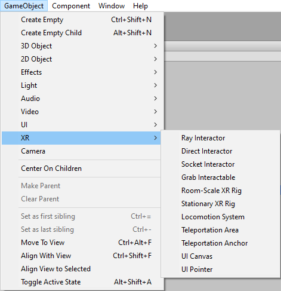
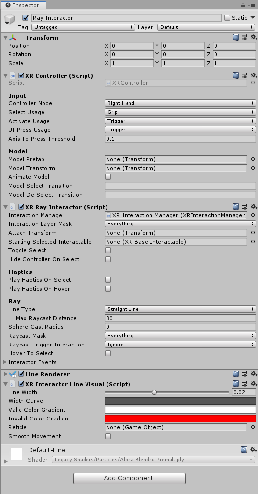
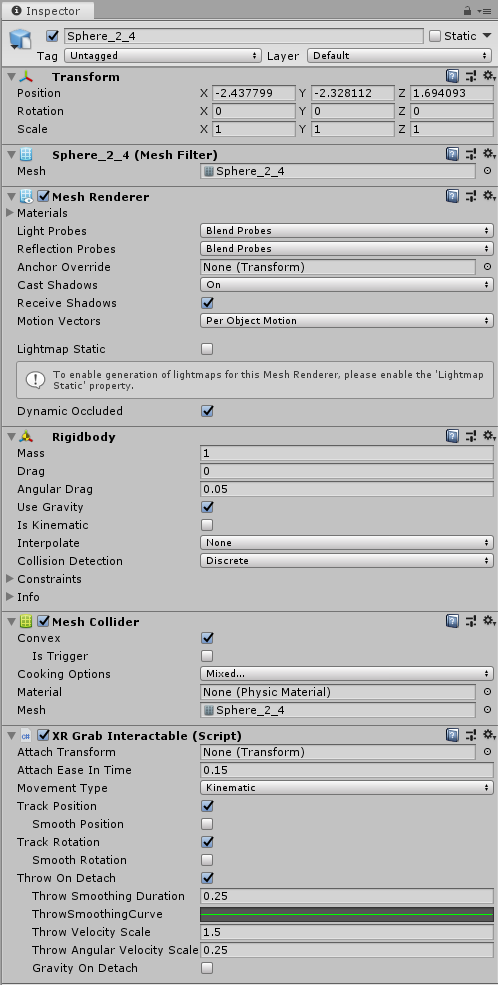
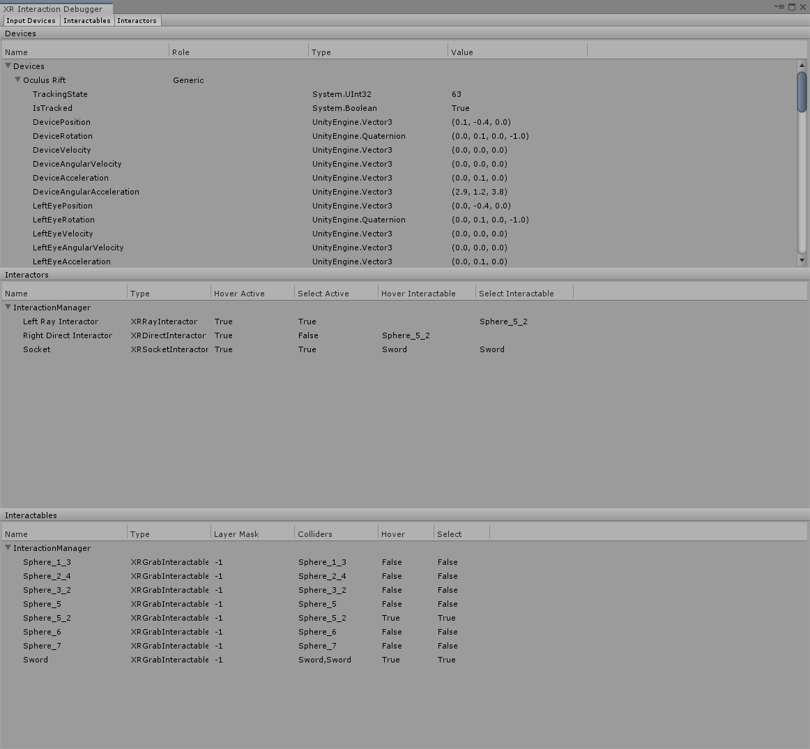
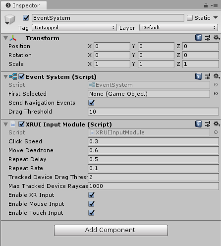
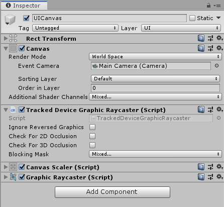
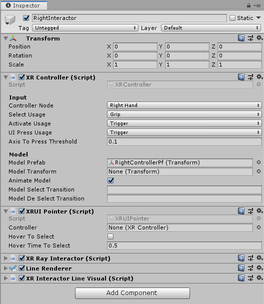
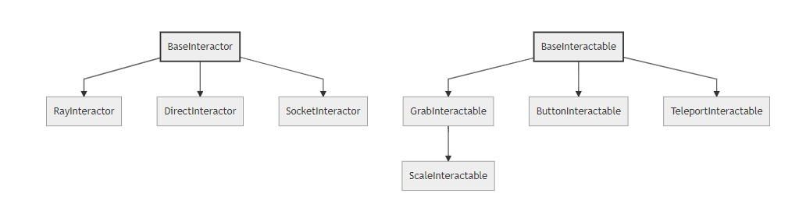
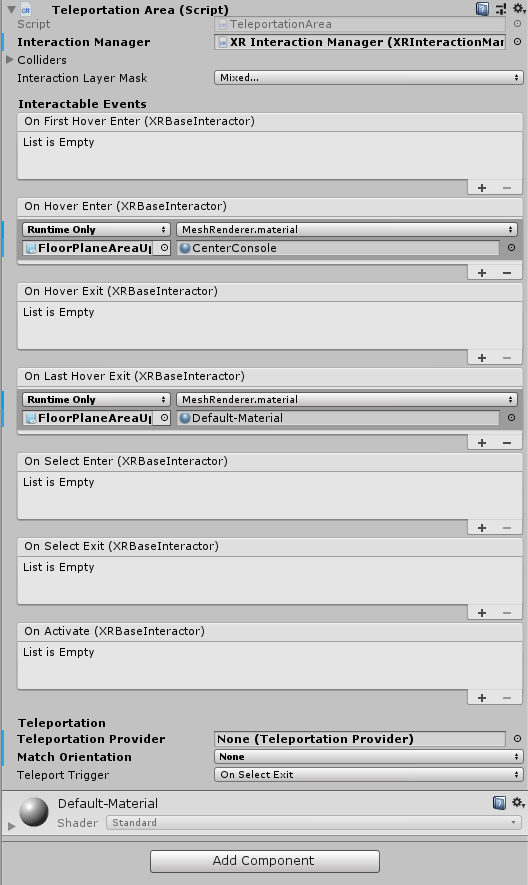

# XR Interaction

The XR Interaction Toolkit package is a high-level component-based system that provides a framework for enabling 3D and UI interactions from Unity input events. The core of this system is a set of base Interactor and Interactable components and an Interaction Manager that ties these two types of components together. It also contains helper components that you can use to extend functionality for drawing visuals and hooking in your own interaction events.

XR Interaction contains a set of components that support the following XR Interaction tasks:
- Cross-platform XR controller input
- Basic object hover, select and grab
- Haptic feedback through XR controllers
- Visual feedback (tint/line rendering) to indicate possible and active interactions
- Basic canvas UI interaction with XR controllers
- A VR camera rig for handling stationary and room-scale VR experiences

To use these AR interaction components, you must have the AR Foundation package in your Project:
- AR gesture system for mapping screen touches to gesture events
- AR interactable for placing objects in the world
- AR gesture interactor and interactables for translating gestures into object manipulation (placement, select, translate, rotate, scale, etc.)
- AR annotations for informing users about AR objects placed in real world

## Installing The XR Interaction Toolkit

To install this package, follow the instructions in the [Package Manager documentation](https://docs.unity3d.com/Packages/com.unity.package-manager-ui@latest/index.html).

## Glossary

| Term | Meaning |
|-|-|
| Controller | A component that turns XR controller input (button press, etc.) into interaction events (hover, select).  Also, provides a way to show controller models and send haptic feedback to a controller. |
| Interactor | An object in a Scene that can select or move another object in that Scene. |
| Interactable | An object in a Scene that can be interacted with (grabbed, pressed, thrown, etc.). |
| Hover | The state where an Interactor is in a valid state to interact with an object (differs between Ray and Direct interaction). |
| Select | The state where an Interactor is currently interacting with an object. |
| Interaction Manager | Manager component that handles interaction between a set of Interactors and Interactables in a scene. |
| Gesture | Sequences of movements that translate into an action that manipulates an interactable. |
| Annotation | Piece of content placed above (or next to) an AR object to give users information and context. |
| Haptic | Sensory or visual stimuli that is sent to the user to give feedback for interaction. |

## Setup

### Setup through GameObject menu

The easiest way to set up a Scene for Interaction is to use the commands under the Game Object > XR menu to create Interaction GameObjects. You can drop Interactors, Interactables and the VR Camera Rig into the Scene from this menu.

### Detailed Setup

#### Interaction Manager

Every Scene that uses the XR Interaction Toolkit needs at least one Interaction Manager to facilitate interaction between Interactors and Interactables. By default, Interactors and Interactables reference the first Interaction Manager they find in the Scene if you don’t specify one. You can also break up larger Scenes with multiple Managers or turn specific ones on and off to enable sets of interaction.

#### Controller/Interactor

An Interactor component enables a GameObject to interact with other objects in the scene.  There are multiple types of Interactors, but for our purpose we will be using a Ray Interactor.  This component utilizes [Unity ray casting](https://docs.unity3d.com/ScriptReference/Physics.Raycast.html) in order to find valid Interactable objects in the scene.  Go ahead and add one of these to a GameObject.

To receive input from a XR input device, the Interactor GameObject also needs a Controller object. Add one of these to your Interactor Game Object and bind some or all of the following actions to an XR input device:

| Action | Required for |
| - | - |
| Position, Rotation, and Select | Basic interaction |
| Activation | Activating a selected object |
| Press | Interacting with UI objects |

The Controller component also allows you to attach a Controller model prefab that shows a visual representation of the XR controller.

The Controller and Interactor have limited support for haptic feedback. To enable haptic feedback, make sure your Controller specify the name of a device that supports haptic feedback with the Haptic Device Name property (you can find this in the Input Debugger - menu: Window > Analysis > XR Interaction Debugger).  The Interactor can then specify intensities and durations of haptic feedback to play back on select and hover.

#### Interactable

Interactable components define how the user can interact with objects in a Scene. In this example, the interactable GameObject supports grabbing, moving, dropping and throwing. Add a Grab Interactable object to the Interactable GameObject in the Scene.

nteractables support a default Sphere collider for detecting interaction, but other types of colliders can provide better hit detection. Add a Mesh Collider to the Interactable object and set the Collider to be convex. The object should now be Interactable.

#### XR Interaction Toolkit Debugger Window

The __XR Interaction Toolkit Debugger__ window gives a top-down view of all the Input Devices, Interactables, and Interactors in a Scene (and their relationship to each other and their parent Interaction Managers). Access this window from the __Window > Analysis__ menu.

## UI Interaction Setup

Interaction with Unity's built-in UI elements requires a few extra steps, particularly when dealing with 3D-tracked devices. The XR Interaction Toolkit package provides a number of new components that allow you to convert an XR controller to work seamlessly with the UI, as well as helper menu options that handle the basic configuration settings for you.

### Using the Helpers

The XR Interaction package comes with two helpers to get you started. Use these helpers to create a new pointer or a new UI canvas. Access them from the __GameObject > XR__ menu.

| Helper | Function |
| - | - |
| UI Pointer | Creates an XRUIPointer component either on the selected object (if the selected object has an XRController), or as a child of the selected object. __Note:__ Make sure that your XRController points to the right device. |
| UI Canvas | Creates a new world-space canvas that you can then add standard UI elements to. If you haven’t configured an EventSystem yet, it also creates and configures a new EventSystem for XR. |

### Custom Setup

#### EventSystem

Add an XRUIInputModule component to a GameObject with the EventSystem component.

The EventSystem component acts as a central dispatch for UI events. It acts as a central location for processing input and updates individual, active canvases. Additionally, each EventSystem needs an InputModule for processing input. For XR, use the XRUIInputModule. The default configuration, pictured below, should work to get you up and running. Only one InputModule can be active at one time.

__Note:__ If you already created a canvas or you created the EventSystem first, you might have a StandaloneInputModule component in your Project. Remove it, or it might block input processing.

#### Canvas

Add a TrackedDeviceGraphicRaycaster script to an existing canvas, and set the canvas __Render Mode__ to __World Space__.

All UI elements exist in the canvas. In the XR interaction Toolkit, a user can only interact with __World Space__ type canvases. The XR Interaction Tookit package contains a new component (pictured below), called the __Tracked Device Graphic Raycaster__. This component lets you use 3D tracked devices to highlight and select UI elements in that canvas.

#### The Pointer

Add an XRPointer to a GameObject with a properly configured XRController.

The XRUIPointer component represents the input device that gets processed for UI interaction. It takes an XRController object and tracks it in Unity space, using the UI Press Usage to select. This component relies mainly on the settings of the linked XRController. If no XRController is selected, Unity defaults to the XRController on the same object.

## Architecture

The XR Interaction Tookit package is a high-level component-based system that provides a framework for composing 3D and UI interactions from Unity input events. The core of this system is a set of base Interactor and Interactable components that act as either subjects or objects in the world, and an Interaction Manager that ties these two types of components together. In addition, there are a number of helper components that extend functionality for drawing visuals and hooking in your own interaction events.

### States

The Interaction system has three common states: Hover, Select, and Activate. These states can mean different things to different Interactables. Hover and Select are loosely related to the traditional GUI concepts of mouse-over and mouse-down. Activate is specific to XR.

| State | Function |
| - | - |
| _Hover_ | When an Interactable is a valid target for an Interactor (in other words, when GetValidTargets for that Interactor returns that Interactable in its list of valid targets), the Interactable is in the Hover state for that Interactor. Hovering an object signifies an intention to interact with it, but doesn’t typically change the behavior of that object (it might create a visual indicator for this change of state, like how a hovered button changes tint). |
| _Select_ | Selection requires an action (button or trigger press) from the user to enable the Selection state. When an Interactable is selected, Unity considers the selecting Interactor to be currently interacting with it. For example, selection can simulate picking up a grabbable object, holding a lever or preparing to push a door that has focus via hovering. |
| _Activate_ | Activation is an extra action (typically mapped to a button or trigger) that affects the currently selected object. This enables the user to further interact with an object they’ve already selected. The Activate action depends entirely on the Interactable. For example, you can use Activate to fire a gun that is currently selected by an Interactor. You can hook the Interactable Event Callbacks component to process Activate into an action without any additional code (by hooking an existing callback into the OnActivate via [UnityEvents](https://docs.unity3d.com/Manual/UnityEvents.html)). |

### Components

#### Interactors
Interactor components handle the actions of hovering and selecting objects in the world. Any object with an Interactable component is registered with an Interaction Manager and checked each frame for the list of possible objects it can hover or select.

#### Interactables
Interactables are objects in a Scene that an Interactor can hover, select, and activate. By default, all Interactables can be affected by all Interactors. You can change this behavior by grouping Interactors and Interactables into complementary Interaction Managers. The Interactable itself defines the behavior of Hover, Select and Activate. The same Interactor might be able to pick up and throw a ball, shoot a gun, or press a 3D button on a keypad.

#### Interaction Manager
The Interaction Manager acts as an intermediary between Interactors and Interactables in a Scene. You can have multiple Interaction Managers, each with their own valid set of Interactors and Interactables. On [Awake](https://docs.unity3d.com/Manual/ExecutionOrder.html), both Interactors and Interactables register themselves with the first found Interaction Manager in the Scene, unless you already assigned them a specific Interaction Manager in the Inspector. Every Scene needs to have at least one Interaction Manager for the system to function.

#### Controllers
The Controller component provides a way to abstract input data and translate it into Interaction states (notably for selection and activation). Position / Rotation / Selection / Activation events are bound via input actions to a specific device's controls, which Interactors then query.

You can also record and play back Input data using the Controller Recorder component. This allows you to to test out interactions or run test Scenes without an XR device attached.

__Note:__ Controller Recorder currently only works in the Editor.

#### Unity Events for Interactors and Interactables 
Both Interactors and Interactables provide a number of Unity Events that you can use to extend their basic features. These components get notified when OnSelectEnter, OnSelectExit, OnHoverEnter, or OnHoverExit state changes occur on the Interactor or Interactable.

### Update Loop
The update loop of the Interaction Manager queries Interactors and Interactables and handles the hover and selection states. First, it asks Interactors for a valid list of targets (used for both hover and selection). Then, it checks both Interactors and Interactables to see if their existing hover and selection objects are still valid. After invalid previous states have been cleared (and exited via OnSelectExit/OnHoverExit), both objects are queried for valid selection and hover states and the new states are entered (via OnSelectEnter/OnHoverEnter).

## AR Interaction

Note: AR interaction components are only available while using Unity 2019.2 or later and in a Project that also includes the [AR Foundation](https://docs.unity3d.com/Packages/com.unity.xr.arfoundation@2.0/manual/index.html) package. You can install the AR Foundation package via the [Unity Package Manager](https://docs.unity3d.com/Packages/com.unity.package-manager-ui@1.8/manual/index.html).

### AR Gestures

AR interaction is mostly driven by an AR Gesture Interactor component that translates touch events into gestures such as tap, drag, and pinch. These gestures get fed down to gesture Interactables that turn these into interactions.

The XR Interaction Tookit package comes with a number of pre-defined gestures and gesture interactables, but you can always extend this package by defining your own gestures.

| Gesture | Triggered by input | Maps to interactable |
|-|-|-|
| Tap | User touches the screen | AR Placement Interactable, AR Selection Interactable |
| Drag | User drags finger across screen | AR Translation Interactable |
| Pinch | User moves two fingers together or apart in a straight line | AR Scale Interactable |
| Twist | User rotates two fingers around a center point | AR Rotation Interactable |
| Two Finger Drag | User drags with two fingers | Nothing currently |

The AR Gesture Interactor component translates screen touches to gestures. Typically, you should place this component on the Camera or another object that has its position driven by the Tracked Pose Driver component. Unity feeds gestures down to Interactables, which then to respond to the gesture event.

### Placement of Objects with AR Placement Interactable

The AR Placement Interactable component facilitates placing objects in the Scene. Users specify a placement prefab that Unity later places on an AR plane when a tap occurs. Unity also generates a ray cast against the plane at the same time. The prefab can contain additional AR interactables to facilitate further gesture interaction. You can also use scripting to change the AR Placement Interactable's placement prefab at runtime to place multiple objects of different types. To do so just modify the placement prefab on this component.

### AR Annotations

Use the AR Annotation Interactable to place annotations alongside virtual objects in an AR Scene. These annotations are prefabs that can shown or hidden when they satisfy a set of constraints. Each annotation can specify a minimum and maximum range from the camera at which to display, as well as a maximum Field of View (FOV) center offset from the camera (to hide or minimize annotations that are not centered in the user's view).

## Extending The XR Interaction Toolkit

You can extend the XR Interaction Toolkit system through either [inheritance](https://unity3d.com/learn/tutorials/topics/scripting/inheritance) or composition. Both Interactors and Interactables derive from an abstract base class that you can derive from and use to hook into the Interaction Manager to provide your own functionality. Additionally, you can use their exposed unity events to add functionality to the existing components.

### Interactor and Interactable Event Callbacks

The easiest way to extend the behavior of Interactor or Interactable components is to use their exposed Unity Event Callbacks. This allows you to hook in your own callbacks (on this Game Object or others) when hovering, selection or activation occurs so you can define your own behavior with no additional coding.

### Extending Interactors

You can derive from the Base Interactor abstract base class to define your own way of interacting with the world. Unity currently provides Direct (collision) and Ray Interactors, but you can decide how you want the user to choose objects in the world and what they can do with them (though typically you do the latter by deriving from the Base Interactable class).  

In addition to standard Unity callbacks, you can override the following methods:

Method/Property | Description
--- | ---
GetValidTargets | Retrieve the list of interactables that this interactor could possibly interact with this frame.
isHoverActive | Gets whether this interactor is in a state where it could hover.
isSelectActive | Gets whether this interactor is in a state where it could select.
CanHover | Determines if the interactable is valid for hover this frame.
CanSelect | Determines if the interactable is valid for selection this frame.
isSelectExclusive | Gets if this interactor requires exclusive selection of an interactable.
overrideSelectedInteractableMovement | Gets whether this interactor can override the movement type of the currently selected interactable.
selectedInteractableMovementTypeOverride | Gets the movement type to use when overriding the selected interactable's movement.
OnHoverEnter | This method is called by the interaction manager when the interactor first initiates hovering over an interactable.
OnHoverExit | This method is called by the interaction manager when the interactor ends hovering over an interactable.
OnSelectEnter | This method is called by the interaction manager when the interactor first initiates selection of an interactable.
OnSelectExit | This method is called by the interaction manager when the interactor ends selection of an interactable.

### Extending Interactables

You can derive from the BaseInteractable abstract base class to define your own way of interacting with the world. Currently, Unity only provides the Grab Interactable, but you can either create your own Interactables from Base Interactable or derive from Grab Interactable if you want to adopt grabbing behavior.

In addition to standard Unity callbacks, you can override the following methods:

Method | Description
--- | ---
IsHoverableBy | Determines if this interactable can be hovered by a given interactor.
IsSelectableBy | Determines if this interactable can be selected by a given interactor.
OnHoverEnter | This method is called by the interaction manager when the interactor first initiates hovering over an interactable.
OnHoverExit | This method is called by the interaction manager when the interactor ends hovering over an interactable.
OnSelectEnter | This method is called by the interaction manager when the interactor first initiates selection of an interactable.
OnSelectExit | This method is called by the interaction manager when the interactor ends selection of an interactable.
OnActivate | This method is called by the interaction manager when the interactor sends an activation event down to an interactable.

------

## Locomotion

The XR Interaction Tookit package provides a set of locomotion primitives to act as an example of how to use the locomotion system primitives. These components are:
- An XR Rig that represents the player
- A Locomotion System
- A Teleportation System, with Teleportation destinations
- A Snap Turn System

The [locomotion documentation](locomotion.md) explains these sections in more detail.

### Requirements

This version of XR Interaction Tookit is compatible with the following versions of the Unity Editor:

* 2019.1 and later (2019.2 for AR interaction components)

### Known limitations

For up to date issues, please reference the GitHub issues repository:
https://github.com/Unity-Technologies/com.unity.xr.interaction.toolkit/issues

### Document revision history

|Date|Reason|
|---|---|
|May 1, 2018|Document created.|
|May 30, 2018|Document revised with commands and updated component names.|
|June 6, 2019|Document revised with updated UI module documentation.|
|July 10, 2019|Document revised with AR interaction documentation.|
|July 18, 2019|Document revised with Locomotion documentation.|
|Jun 31, 2019|Finalized Locomotion documentation.|
|August 13, 2019|Document edits.|
|September 4, 2019|Document revised with updated images and component names.|
|October 3, 2019|Document update to reflect package naming for release|
