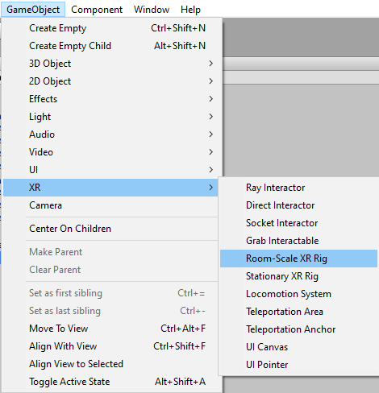
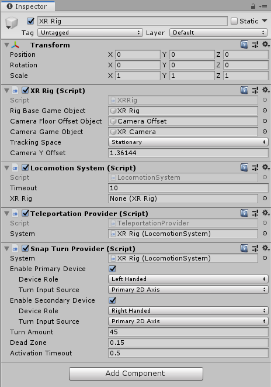
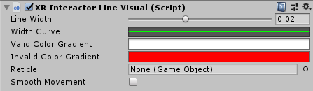
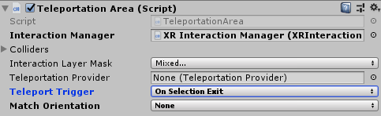
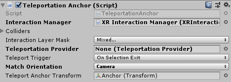

# Locomotion

The XR Interaction package provides a set of locomotion primitives to provide the means to move about a scene during an XR experience. These components are:
- An XR Rig that represents the player
- A Locomotion System
- A Teleportation System, with Teleportation destinations
- A Snap Turn System

The following sections of this document outline how to use and extend these systems.

---

## Glossary
| Term | Meaning |
|-|-|
| XR Rig | MonoBehaviour that specifies a Rig, a Camera Offset, a Camera. Also provides Stationary or Room-Scale options of tracking space to configure the XR Rig. |
| Rig | The base GameObject of the XR Rig. This is the GameObject that will be manipulated via locomotion. By default it is the object that XR Rig is attached to.|
| Camera Offset | GameObject to move the Camera to desired height off the floor. |
| Camera | GameObject that contains a camera component, this is usually the main camera that renders what the user sees, and is usually the 'head' of XR rigs. |
| Room-Scale | A floor-relative tracking mode. When the scene starts, the origin is the floor. |
| Stationary | A device-relative tracking mode. When the scene starts, the origin is the device. The camera will be moved to the height set by Camera Offset. |
| Locomotion System | MonoBehaviour that controls which Locomotion Provider has the access to move the Rig. |
| Locomotion Provider | Base class for various locomotion implementations. |
| Teleportation | A type of locomotion that teleports the user from one position to another position. |
| Snap Turn | A type of locomotion that rotates the user by a fixed angle. |

## Setup a basic scene for Teleportation and Snap Turn

### 1. Setup XR Rig 

The easiest way to setup an XR Rig is to use the command either `Room-Scale XR Rig` or `Stationary XR Rig` under the `GameObject/XR` menu. This creates an XR Rig object in the scene and sets the Tracking Space to Room-Scale or Stationary, this also creates an Interaction Manager if there isn't one in the scene. 

### 2. Add Locomotion System with Teleportation and SnapTurn Providers

- On the `XR Rig` GameObject, add a `Locomotion System`, a `Teleportation Provider` and a `Snap Turn Provider`.
- To setup Snap Turn, on the `Snap Turn Provider` script, enable the primary device and (optionally) the secondary device, and set their Device Role and Turn Input Source. For a hand Controller with a joystick, the Device Role field should be `LeftHanded` or `RightHanded`, and the Turn Input Source field should be `Primary 2D Axis`.

### 3. Create Teleportation Interactables

- Create a `Plane` using the menu `GameObject/3D Object/Plane`.
- Add a `Teleportation Area` script or a `Teleportation Anchor` script to the Plane object.

Now you should have a basic scene with Teleportation and Snap Turn System working and be able to perform Teleportation and Snap Turn with your Controllers. The following step explains additional details you can configure to change the line visual of the `XR Ray Interactor`.

### 4. Set Line Type

`XR Ray Interactor` can be found on each of the hand Controller under XR Rig. It provides three default line types for you to use for Teleportation: Straight Line, Projectile Curve, Bezier Curve.

| Straight Line Parameter | Meaning |
|-|-|
| Max Raycast Distance | Max distance of raycast. Increase this value will let you reach further. |

For VR Teleportation, we recommending using `Projectile Curve` instead of Straight Line. The Projectile Curve is generated by sampling the trajectory of a projectile with an initial velocity and gravity in the reference frame. You can use the angle of the Controlller to control the distance of the landing point. When you lift your Controller up, the landing point will first go further, and when you keep lifting it the landing point will come back closer.

| Projectile Curve Parameter | Meaning |
|-|-|
| Reference Frame | The reference frame of the projectile. If not set it will find the XR Rig, this will make the curve always go up then down in the tracking space. If it is set to self or the XR Rig does not exist, the curve will rotate with the Controller. |
| Velocity | Initial velocity of the projectile. Increase this value will make the curve reach further. |
| Acceleration | Gravity of the projectile in the reference frame. |
| Additional FlightTime | Additional flight time after the projectile lands. Increase this value will make the end point drop lower in height. |
| Sample Frequency | The number of sample points of the curve, the higher the better quality. |

Another option is the Beizer Curve using a control point and an end point in addition to the start point, which is the position of the `Attached Transform` of the `Ray Interactor`. Unlike Projectile Curve, it's referrence frame is by default set to self, as a result you will see the curve rotate with the Controller.

| Beizer Curve Parameter | Meaning |
|-|-|
| End Point Distance | Increase this value distance will make the end of curve further from the start point. |
| End Point Height | Decrease this value will make the end of the curve drop lower relative to the start point. |
| Control Point Distance | Increase this value will make the peak of the curve further from the start point. |
| Control Point Height | Increase this value will make the peak of the curve higher relative to the start point. |
| Sample Frequency | The number of sample points of the curve, the higher the better quality. |

### 5. Set Line Visual

The `XR Interactor Line Visual` gives you additional options to customize the look of your line for Teleportation. It requires the Line Render component and gets line points from the Ray Interactor.

| Options | Meaning |
|-|-|
| Line Width | The width of the line (in centimeters). |
| Width Curve | The relative width of the line from the start to the end. |
| Valid Color Gradient | When the line hits any collider of valid targets, the line changes to this color gradient. |
| Invalid Color Gradient | When there is no valid place to teleport, the line changes to this color gradient. |
| Reticle | GameObject to visualize the destination of Teleportation. |
| Smooth Movement | If enabled, the rendered line will be delayed from and smoothly follow the ray cast line. |

## Architecture

The Locomotion System is responsible for managing one XR Rig. The XR Rig handles the users position in Unity world space. The Locomotion System can restrict access to the XR Rig while Locomotion Providers are moving it. 

E.G: At the request of the Teleportation Provider, the Locomotion System will lock the XR Rig while in a teleport action. This ensures that the user cannot do multiple actions (like snap turning, or teleporting again) while the current action is active. 

Once the teleport has finished, the Teleportation Provider relinquishes the exclusive lock on the system and other Locomotion Providers can then be used to influence the XR Rig. 

Locomotion Providers can modify the XR Rig without taking exclusive access if necessary, however those Locomotion Providers that do this should always check to see if the Locomotion System is busy before applying any changes to the XR Rig.

The overall flow of a Locomotion request is as follows:
1. The Locomotion Provider implementation will check to see if the Locomotion System is currently busy.
2. If not, the Locomotion Provider will request exclusive access to the Locomotion System
3. If the request is successful, the Locomotion Provider will move the XR Rig.
4. When the Locomotion Provider has finished modifying the users position/rotation, the Locomotion Provider will relinquish exclusive access to the Locomotion System.

If the Locomotion System is busy, or the Locomotion Provider is unable to gain exclusive access to the Locomotion System then the Locomotion Provider must not modify the Locomotion System's XR Rig. 

--- 

### XR Rig

The XR Rig is used by the Locomotion System as the anchor for the player. 

Before detailing the options on the XR Rig component. Its important to understand the recommended hierarchy of game objects to support Interaction.

The image below shows the XR Rig component. 

The `Rig Base Game Object` is used to indiciate which game object acts as the transform from tracking space into world space. In the recommended hierarchy this is the "XR Rig" game object.

The `Camera Floor Offset Object` is used to set which object will have a vertical offset applied if the device tracking origin does not contain the users height.

The `Camera Game Object` field is used to indiciate which game object holds the player's camera. This is important as the user's camera may not be at the origin of the tracking volume. In the suggested hierarchy this is the "Camera" game object.

The `Tracking Space` field is used to set the desired tracking space used by the application

The `Camera Y Offset` is the number of world space units that the Game Object specified by the `Camera Floor Offset Object` will be moved up vertically if the device tracking origin does not contain the users height.

---

### Locomotion System

The Locomotion System is a Monobehaviour that acts as the arbitrator for Locomotion Providers access to an XR Rig. 

The following is an image of the Locomotion System Monobehaviour:

The `Timeout` field is used to control the maximum amount of time a single Locomotion Provider can keep exclusive access of the Locomotion System. In this example the value is set to 600 seconds.

The `XR Rig` field is used to select which XR Rig this Locomotion System will control. You can have as many Locomotion Systems, and XR Rigs in your scene as necessary. By default, it will find the object of type `XR Rig` in the scene.

We recommend that the Locomotion System Monobehaviour be located on the XR Rig GameObject. See the recommended hierarchy setup for interaction for more information.

---

### Locomotion Providers

Locomotion Providers are where different types of locomotion are implemented. Two Locomotion Providers are supplied as part of the XR Interaction package. The Teleportation Locomotion Provider and the Snap Turn Locomotion Provider. Both implement the `LocomotionProvider` abstract class. 

The Locomotion Provider class provides a simple interface to request, and relinquish exclusive access to the configured Locomotion System Monobehaviour. If no Locomotion System class is configured then the Locomotion Provider will attempt to find a Locomotion System Monobehaviour in the current scene.

To request exclusive access to the Locomotion System, the `BeginLocomotion` function is used. To relinquish access to the Locomotion System, the `EndLocomotion` function is used. It is up to the implementation of Locomotion Provider to call these funtions as appropriate. It is the responsibility of the Locomotion Provider to relinquish its access when it has finished interacting with the Locomotion System. 

The `CanBeginLocomotion` function can be used to check to see if the LocomotionSystem is currently in exclusive mode before attempting to call `BeginLocomotion` to acquire it. 

The LocomotionProvider abstract class also providers two events. `startLocomotion` and `endLocomotion`. `startLocomotion` is invoked on a successful call to `BeginLocomotion`. `endLocomotion` is invokved on a succesful call to `EndLocomotion`.

The XR Interaction system provides two implementations of a Locomotion Provider. The Teleport Locomotion Provider, and the SnapTurn Locomotion Provider. These are discussed in more detail in the sections below.

---

### Teleportation

The XR Interaction system provides a simple implementation of teleportation. This implementation includes a number of components to demonstrate how to implement complex locomotion scenarios using the LocomotionProvider and LocomotionSystem interfaces.

The Teleportation Provider inherits from the LocomotionProvider abstract class. The Teleportation Provider is responsible for moving the XR Rig to the desired location as requested by the user.

This implementation has two types of teleportation destinations. An 'Anchor' Based teleportation destination, and an 'Area' Based teleportation destination. These are discussed in more detail further below. In short:
- Anchors will always teleport the user to a specific position and/or rotation specified by the anchor.
- Areas allow the player to choose a location on a surface that they wish to teleport to.

Both types of teleportation destinations are implemented on top of the XR Interaction system using the Base Teleportation Interactable as the starting point for shared code.

The XR Interaction system also provides various line rendering options, the documentation for these elements can be found [in the main documentation for the Interaction Package](com.unity.xr.interaction.md).

---

#### Teleportation Provider

The Teleportation Provider Component implements the LocomotionProvider abstract class. You can have as many instances of the Teleportation Provider Component in your scene as you need, in most cases however a single instance will be sufficient. We recommend that this instance be placed under the XR Rig game object.

The following image shows the Teleportation Provider Monobehaviour.

The `System` field should reference the Locomotion System monobehaviour that you want the teleportation provider to interact with. If no system is provided, the provider will attempt to find a Locomotion System in the current scene.

---

#### Teleport Area Interactable

The Teleport Area interactable allows the user to select any location within the teleport anchor as their destination.  The Teleport Area Interactable is a specalization of the `BaseTeleportInteractable`.

The Teleport Area interactable is intended to be used by, or by any specializations of, the Ray Interactor. The Teleport Area Interactable uses the intersection point of the ray to the area's collision volume to determine the location the user wishes to teleport to. The Teleport Area Interactable has a specialized implementation of the `GenerateTeleportRequest` function which is used to generate a teleportation request that is queued with the Teleportation Provider.

The following is an example of the Teleport Area Interactable

The settings on the Teleportation Area Interactable are similar to other interactables. This documentation will only cover the new elements added to support teleportation.

The `Teleportation Provider` field of the Teleport Area Interactable indicates which Teleportation Provider this Interactable will communicate with. If a Teleportation Provider is not configured, the Interactable will attempt to find a Teleportation Provider in the current scene.

The `Teleport Trigger` field option is used to specify whether the teleportation will be triggered when the user exits the selection or when the user enters the selection.

The `Match Orientation` field option is used to specify which object's orientation in the rig will be matched with the destination after teleporting. The options are detailed in the table below.

Match Orientation | Explanation 
--- | --- 
None | This should be the default option when teleporting on a surface and keep the orientation consistent.
Camera  | This option can be useful when using the Teleportation Anchor, if you wish to rotate the user and have the camera look at something in the forward direction the anchor. Note that the up-and-down of the camera angle will not be manipulated. 
---

#### Teleport Anchor Interactable

The Teleport Anchor allows the user to teleport to an anchor location by selecting the anchor, or an area around it. The Teleport Anchor Interactable is a specalization of the `BaseTeleportInteractable`.

The Teleport Anchor interactable is intended to be used by, or any specializations of, the Ray Interactor. The Teleport Anchor Interactable uses the intersection point of the ray to the area's collision volume to determine the location the user wishes to teleport to. The Teleport Anchor Interactable has a specialized implementation of the `GenerateTeleportRequest` function which is used to generate a teleportation request that is queued with the Teleportation Provider.

The following is an example of the Teleport Anchor Interactable

The settings on the `Teleportation Anchor` Interactable are similar to the `Teleport Area` Interactables, this documentation will only cover the new elements.

The `Teleport Anchor Transform` field is used to define the transform that the XR Rig will be teleported to when the user teleports to this anchor. Both the position, and the rotation of the Anchor transform will be used, depending on which Teleport Type is chosen

---

### Snap Turn

The XR Interaction package provides an example implementation of a Snap Turn Provider. A Snap turn is when the user is rotated some fixed amount when an configured input is recevied. E.G: a joystic is moved to the left, or a dpad is pressed to the right. 

The following image is an example of the Snap Turn Provider

The `Enable Primary Device` and `Enable Secondary Device` toggles turn on or off input processing for the devices configured in the items below the checkboxes. The configuration options for both the Primary and Secondary Devices are the same.

The `Device Role` option allows the user to select which input device will be sampled from.

The `Turn Input Source` selects which input feature will be used to read data from.

The `Turn Amount` field details how far the XR Rig will be rotated around the Y axis in degrees during each snap turn.

The `Dead Zone` field is the amount of distance that the controller movement will have to be above to trigger a snap turn.

The `Activation Timeout` field is used to indicate how much time must pass after a successful snap turn before a second snap turn can be triggered. 

--- 