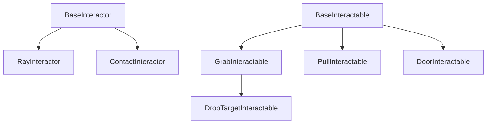
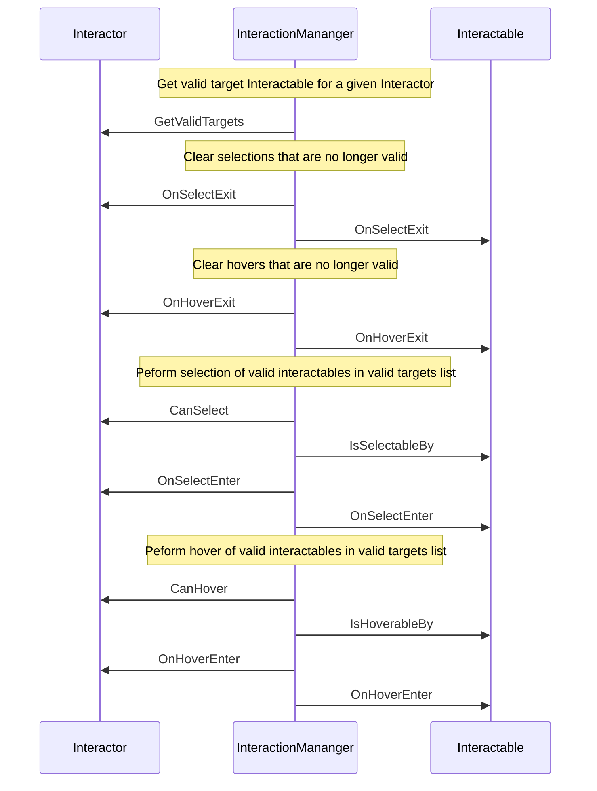

# xrff_class_hierarchy

```mermaid
graph TD;
    BaseInteractor-->RayInteractor;
    BaseInteractor-->ContactInteractor;
    BaseInteractable-->GrabInteractable
    GrabInteractable-->DropTargetInteractable
    BaseInteractable-->PullInteractable
    BaseInteractable-->DoorInteractable
```

# xrft_interaction_update.png

```mermaid
%% Interaction
  sequenceDiagram
    participant Interactor
    participant InteractionMananger
    participant Interactable
    Note over InteractionMananger: Get valid target Interactable for a given Interactor
    InteractionMananger->>Interactor: GetValidTargets
    Note over InteractionMananger: Clear selections that are no longer valid
    InteractionMananger->>Interactor: OnSelectExit
    InteractionMananger->>Interactable: OnSelectExit
    Note over InteractionMananger: Clear hovers that are no longer valid
    InteractionMananger->>Interactor: OnHoverExit
    InteractionMananger->>Interactable: OnHoverExit
    Note over InteractionMananger: Peform selection of valid interactables in valid targets list 
    InteractionMananger->>Interactor: CanSelect
    InteractionMananger->>Interactable: IsSelectableBy
    InteractionMananger->>Interactor: OnSelectEnter
    InteractionMananger->>Interactable: OnSelectEnter
    Note over InteractionMananger: Peform hover of valid interactables in valid targets list 
    InteractionMananger->>Interactor: CanHover
    InteractionMananger->>Interactable: IsHoverableBy
    InteractionMananger->>Interactor: OnHoverEnter
    InteractionMananger->>Interactable: OnHoverEnter
```
