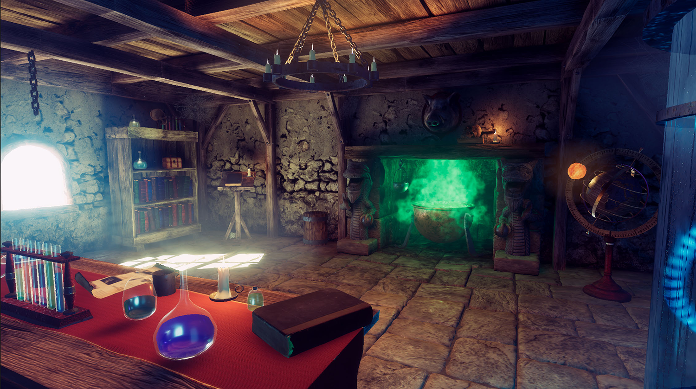
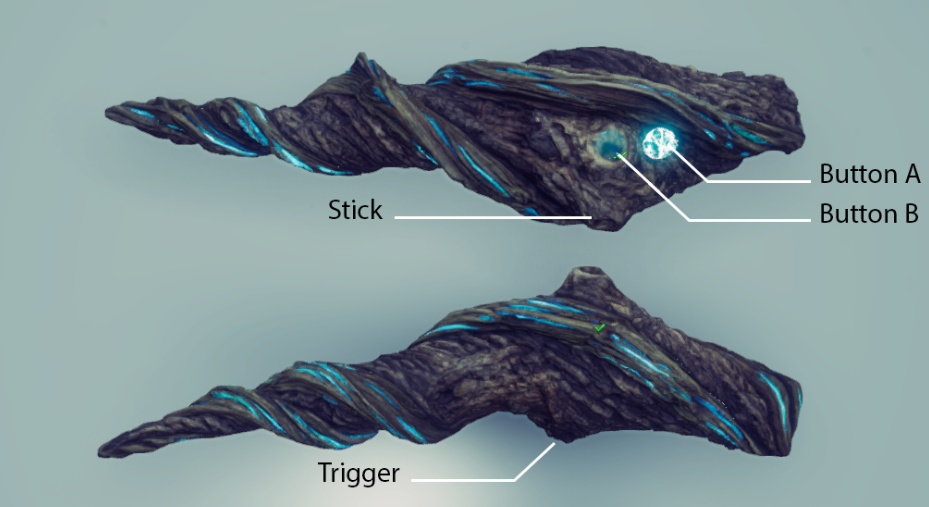
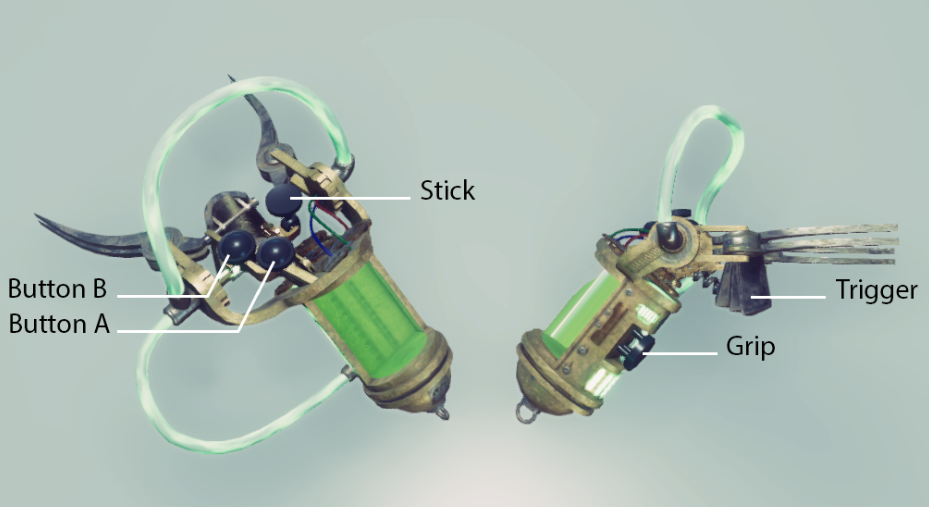
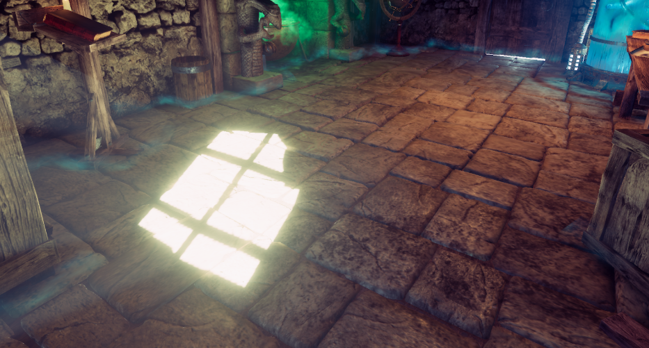
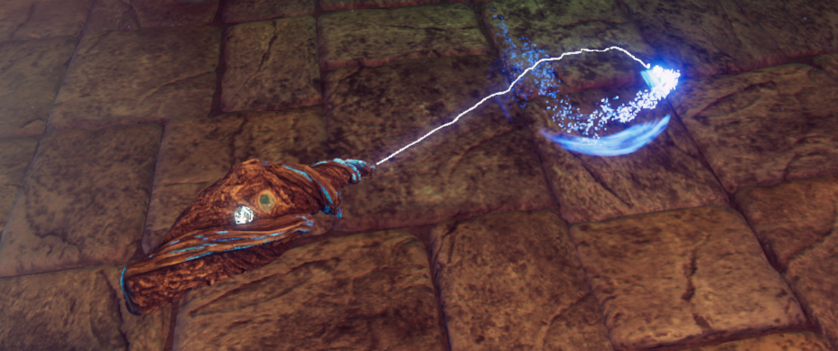
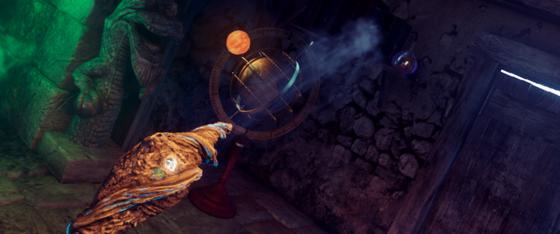
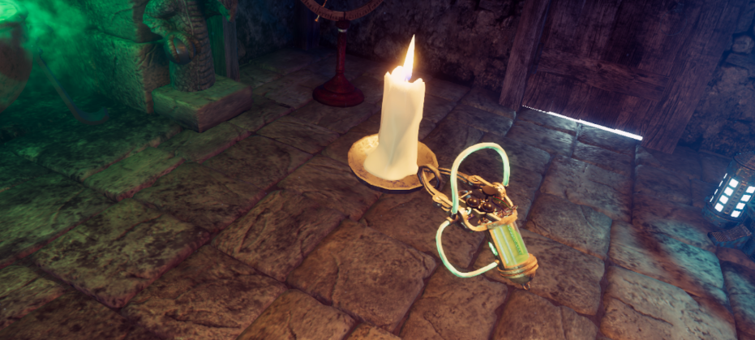

# The alchemy lab : a VR project with High Definition Render Pipeline

This project is designed for the Oculus Rift and Rift S. It's made using Unity 2019.3.1f1 and HDRP 7.2.0.

The controllers are not configured correctly for other VR platforms.

This Project uses the XR Interaction Package.

| IMPORTANT                                                    |
| ------------------------------------------------------------ |
| This project uses Git Large Files Support (LFS). Downloading a zip file using the green button on Github **will not work**. You must clone the project with a version of git that has LFS. You use a client like [Fork](https://git-fork.com/) which already uses LFS or download Git LFS here: <https://git-lfs.github.com/>. |

# Interactions

### Left Controller

Button A: Active the teleport ray casting. Target on floor the point to teleport in the teleport area. Use the trigger button to teleport.Button B: Active the distance grab ray. Target an object gradable and use the trigger to catch it.Stick used to turn at 45°

### Right Controller

Use the grip button to directly grab objects.Use button A and B to interact with the grabbed objects by the right or the left controller.Use the stick to turn the page when a book is opened.

### Teleport area

The teleport area defines the space where the player can evolve in the environment.The teleport behavior is managed by the teleportation Area component.

The teleport area limits are defined by a blue smoke on the ground. 

### Teleport

The teleport action is controlled by the A button on the left controller. The player has to focus the point where he wants to teleport while he press the A button and he uses the trigger button to activate the teleport.

### Grab

The distance grab is the default mode for the left controller. It allows you to attract distant objects to you. It is automatically re-activated when releasing the A button. When the distance grab is enabled, the B button is lit on the left controller. 

When the ray aims at a grabbable object, a Visual Effect is shown and a sound can be hear.

The direct grab is controlled by the grip button of the right controller.

# Interactive objects

#### Flasks and test tubes

The test tubes and the open flasks contain interactive liquid. They can be used to interact with the cauldron. 

They use some scripts and shader graphs to manage the fluid animation. The spilling liquid uses a Visual Effect.

#### Books

Books can be grabbed with any controller, and then the player can interact with them using the right controller.

While grabbed, the right controller A button opens the book and the B button closes it. The right controller stick is used to turn the pages.

The books are composed of some parts of the photogrammetry workflow documentation. This documentation can be found here https://unity.com/solutions/photogrammetry.

The pages of the books are managed by a Visual Effect done with the Visual effect graph. More information about the Visual effect graph here https://unity.com/fr/visual-effect-graph or on the forum here https://forum.unity.com/threads/welcome-to-the-visual-effect-graph-forum.821184/.

#### Candle

The candle flame's material uses Shader Graph to react to the candle orientation.

#### Globe

The globe can be manipulated by colliding with it using the controllers.

#### Cauldron

The Cauldron interacts with the test tubes and open flasks. Spill their liquid in the cauldron to change its color.

#### More

Explore the scene and find more interactions : chests, 

Many objects in the scene have a physical behavior (Table cloth, spider web, mug, skull, …).
