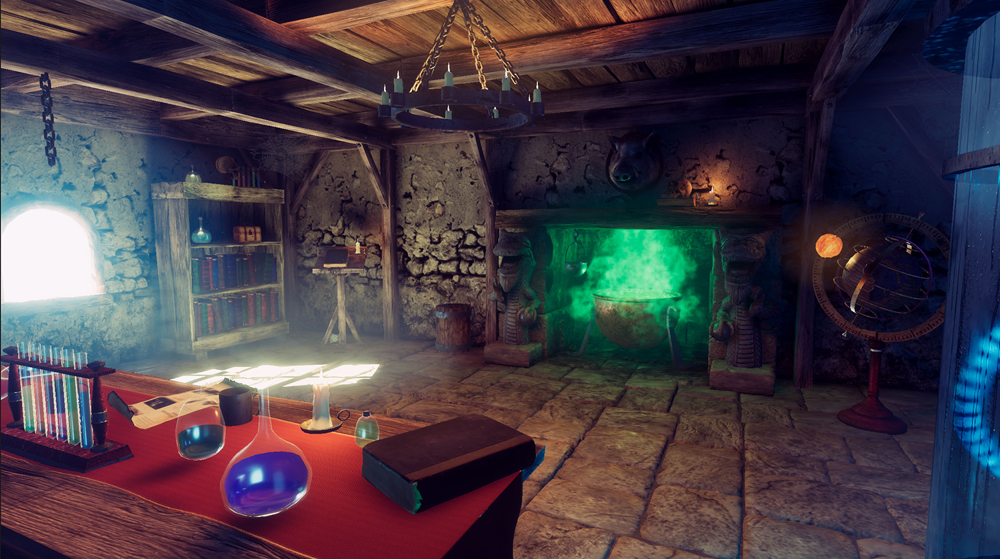
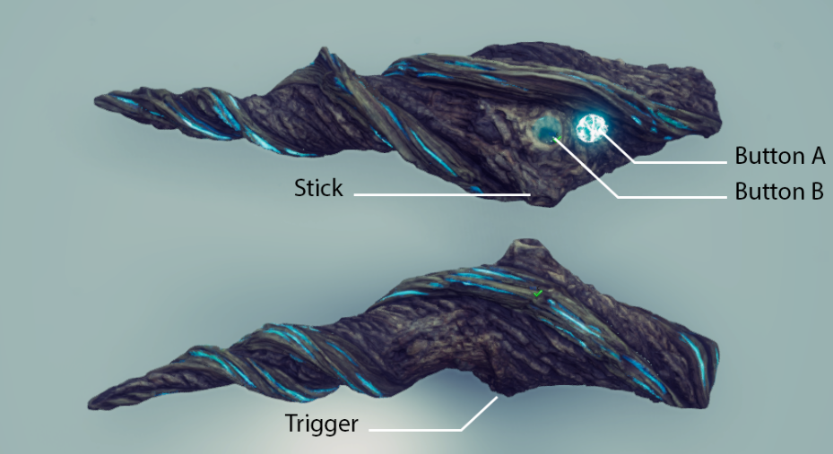
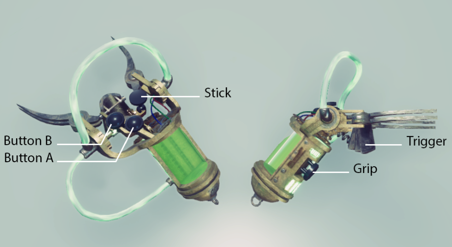
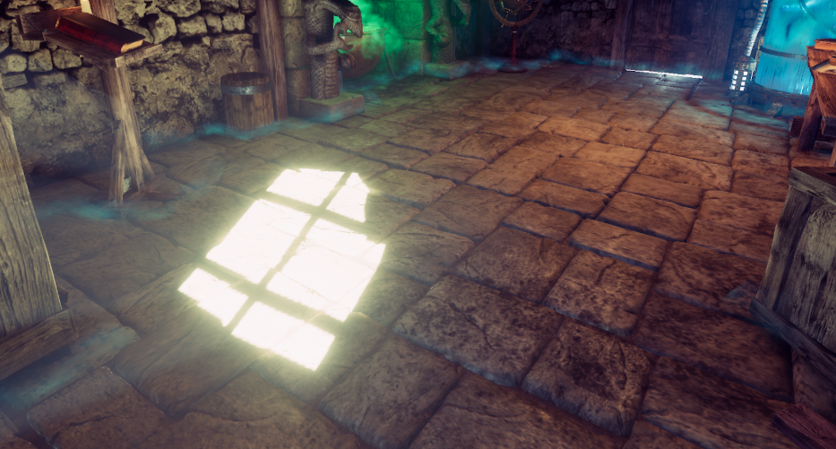
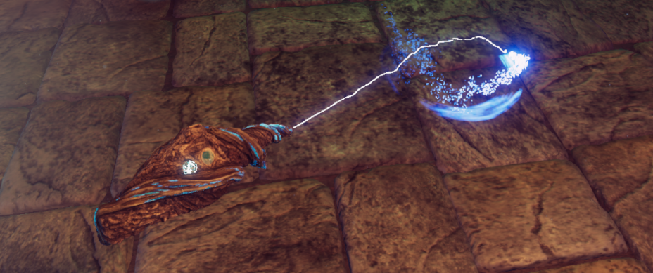
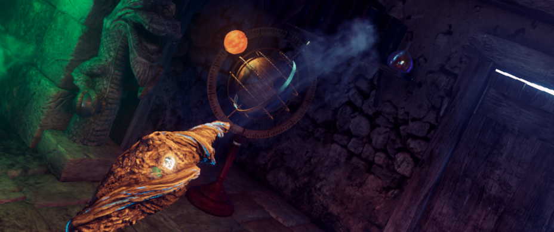
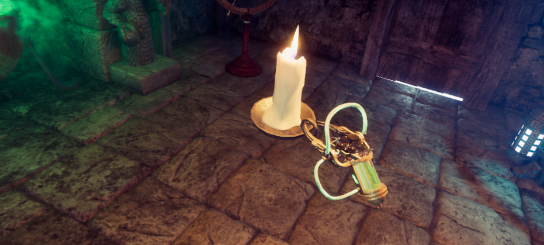

# The alchemy lab URP: a VR project with Universal Render Pipeline

This project is designed for the Meta Quest 3. It's made using Unity 6000.6.0a1 and URP 17.6.0.

The controllers are not configured correctly for other VR platforms.

This Project uses the XR Interaction Package.

| IMPORTANT                                                    |
| ------------------------------------------------------------ |
| This project uses Git Large Files Support (LFS). Downloading a zip file using the green button on Github **will not work**. You must clone the project with a version of git that has LFS. You use a client like [Fork](https://git-fork.com/) which already uses LFS or download Git LFS here: <https://git-lfs.github.com/>. |

# Interactions

### Left Controller

Button A: Activates the teleport ray. Aim at a valid point on the floor within the teleport area. Push the stick forward to teleport.

Button B: Activates the distance‑grab ray. Aim at a grabbable object and use the grip button to catch it. Move the stick left or right to rotate by 45°.

### Right Controller

Use the grip button to directly grab objects. Use buttons A and B to interact with the grabbed objects. When a book is open, use the stick to turn the page.

### Teleport area

The teleport area defines the space where the player can move within the environment. The teleport behavior is managed by the Teleportation Area component.

The limits of the teleport area are indicated by a blue smoke effect on the ground.

### Teleport

The teleport action is controlled by the A button on the left controller. The player must aim at the point where they want to teleport while pushing the stick upward to activate the teleport.

### Grab

Use the B button on the left controller to activate the distance grab. It allows you to pull distant objects toward you. When distance grab is enabled, the B button lights up on the left controller.

When the ray is aimed at a grabbable object, a visual effect appears and a sound can be heard.

The direct grab is controlled by the grip button on the right controller.

# Interactive objects

#### Flasks and test tubes

The test tubes and open flasks contain interactive liquid. They can be used to interact with the cauldron.

They use custom scripts and Shader Graphs to manage the fluid animation. The spilling liquid is handled by a Visual Effect.

#### Books

Books can be grabbed with either controller, and the player can then interact with them using the right controller.

While a book is grabbed by the right controller, the A button on the right controller opens it and the B button closes it. The right controller’s stick is used to turn the pages.

The books contain excerpts from the photogrammetry workflow documentation. This documentation can be found here: 
https://unity.com/solutions/photogrammetry.

The pages of the books are driven by a Visual Effect created with the Visual Effect Graph. More information about the Visual Effect Graph can be found here: https://unity.com/fr/visual-effect-graph or on the forum here: https://forum.unity.com/threads/welcome-to-the-visual-effect-graph-forum.821184/.

#### Candle

The candle flame’s material uses Shader Graph to react to the candle’s orientation.

#### Globe

The globe can be manipulated by pushing or colliding with it using the controllers.

#### Cauldron

The cauldron interacts with the test tubes and open flasks. Pour their liquid into the cauldron to change its color.

#### More

Explore the scene and discover additional interactions, such as chests.

Many objects in the scene have physical behavior (tablecloth, spider web, mug, skull, etc.).
